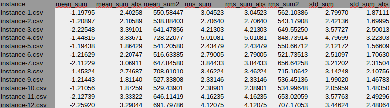

# Desafio SENAI: Linhas de Tensão

<p align="center">
  <a href="#">
    
  </a>
  <a href="#">
    
  </a>
  <a href="#">
    
  </a> 
</p>

Este projeto tem por objetivo divulgar a solução para o desafio proposto pelo Instituto Senai de Inovação em Sistemas Embarcados.

Este projeto foi programado utilizando a linguagem de programação Python versão 3.8.5 e utilizando o sistema operacional Linux - Ubuntu.

## Visão Geral

A organização desse projeto foi feita através da separação em diversos diretórios, que estão listados a seguir:

* **data** -> Pasta contendo um conjunto de arquivos de dados para treinamento, teste e avaliação do projeto. [[data](./data/)]
* **docs** -> Pasta contendo a documentação do projeto desenvolvido. [[docs](./docs/)]
* **models** -> Pasta contendo as features extraídas do arquivo de instância. [[models](./models/)]
* **src** -> Pasta contendo os principais códigos-fonte do projeto. [[src](./src/)]
* **test** -> Pasta contendo os arquivos de teste unitário de software. [[test](./test/)]

## Enunciado do Problema

**Problema:** As linhas de tensão podem sofrer um fenômeno chamado descarga parcial. Essas descargas danificam gradativamente as linhas de tensão e portanto devem ser identificadas e reparadas. As linhas de tensão podem estar em condições de operação boas ou ruins. 

**Desenvolvimento:** Desenvolva um método de Aprendizado de Máquina que seja capaz de identificar a ocorrência ou não de descargas parciais. Desenvolva o pipeline completo de um projeto de Aprendizado de Máquina, desde a análise e preparação dos dados adquiridos até a disponibilização do algoritmo em Container (utilizando Docker) no GitHub.

O enunciado completo do problema pode ser encontrado no [arquivo](./docs/prova_pratica_p2_2021.pdf).

## Dataset

Para executar o projeto é necessário baixar o dataset no [link](https://drive.google.com/u/0/uc?id=17LPP_ZZprHIG3R2f0Vhg5CyfFZOMvlia&export=download) e colocar o arquivo (`database.csv`) na pasta [[data](./data/)]. 

:warning: **Nota:** O arquivo `database.csv` possui 1.2 GB, assim não foi disponibilizado no github. 

Como forma de facilitar a manipulação de dados e o trabalho o `database.csv` foi quebrado em 167 arquivos menores. Assim, tem-se um arquivo por instância do problema. O script `script-file-split.sh` auxilia nesta tarefa de quebrar a base de dados em várias instâncias. Assim, para executar esse script execute o comando: 

```
$ ./data/script-file-split.sh
```

Após esse procedimento cerca de 167 arquivos de instâncias são criados com aproximadamente 7.5 MB cada. As instâncias criadas possue o seguinte padrão no nome `instance-n.csv`, onde n é o número da instância.

:warning: **Nota:** As primeiras 800000 colunas da base de dados indicam a leitura da tensão nas linhas de energia. As últimas 3 colunas da base de dados representam respectivamente o ID do sinal, a fase e o target. No processamento do problema foram removidos as informações ID do sinal e a fase, pois eles não contribuem no problema. 

## Organização Geral da Base de Dados

| Atributo   | Instâncias em Condições de Operação Boas                | Instâncias em Condições de Operação Ruins        |
|------------|---------------------------------------------------------|--------------------------------------------------|
| Quantidade | 156                                                     | 11                                               |
| Lista      | Todas - [2, 68, 77, 91, 94, 96, 99, 137, 145, 146, 153] | [2, 68, 77, 91, 94, 96, 99, 137, 145, 146, 153]  |

## Características do Problema

- [x] Problema de classificação
- [x] Quantidade de classes 2
- [x] Base de dados contém 167 instâncias diferentes
- [x] Cada instância possui 3 séries temporais (3 fases)
- [x] Cada série temporal (fase) contém 800000 dados
- [x] Cada série temporal é uma onda senoide completa
- [x] As fases estão deslocadas por 120 graus ou por 800000/3 leituras de dados
- [x] Quantidade de dados sem descargas parciais (normal): 156
- [x] Quantidade de dados com descargas parciais (anormal): 11
- [x] Dataset desbalanceado

## Como Executar o Projeto

Para executar esse projeto execute o comando a seguir:

```
$ python ./src/code-ai.py
```

## Como Executar os Testes Unitários

Foram criados alguns testes unitários. Para executar os testes unitários do projeto execute o seguinte comando:

```
python -m unittest test.test_basic
```

Para executar apenas um teste específico um comando semelhante ao abaixo: 

```
python -m unittest test.test_basic.BasicTests.test_file_analysis_instance1
```

## Arquivos de Entrada com as Features

Na pasta [models](./models/) encontra-se alguns arquivos de entrada com algumas features extraídas da base de dados. 
Esses arquivos estão no formato CSV, em que nas linhas tem-se as instâncias e nas colunas tem-se as features extraídas do modelo. 
A seguir é mostrada uma imagem com a estrutura geral desse arquivo.



Durante a Análise Exploratória dos Dados foram capturadas cerca de 40 features de forma serem utilizadas no treinamento do modelo de aprendizado de máquina.

## Organização do Projeto

```
desafio-senai
├── data
│   ├── database.csv
│   ├── instances
│   │   ├── instance-1.csv
│   │   ├── instance-2.csv
│   │   ├── instance-3.csv
│   │   └── ...
│   └── script-file-split.sh
├── docs
│   ├── analise-exploratoria-dos-dados.ods
│   ├── figures
│   │   ├── formato-arquivo-features.png
│   │   ├── sinal-teoria.png
│   │   └── ...
│   ├── prova_pratica_p2_2021.pdf
│   └── RESULTS.md
├── models
│   ├── model-features.csv
│   ├── model-features2.csv
│   └── ...
├── src
│   ├── __init__.py
│   ├── code-ai.py
│   └── code-eda.py
├── test
│   ├── __init__.py
│   └── test_basic.py
├── LICENSE
├── README.md
└── requirements.txt
```

## Resultados

Alguns dos principais resultados produzidos podem ser encontradas [aqui](https://github.com/jesimar/desafio-senai/tree/main/docs)

## Limitações do Projeto

* Não foi utilizado Container com Docker.

## Alguns Comandos Úteis

Alguns comandos que podem ser úteis para visualizar e extrair dados do arquivo `database.csv` são head, tail e tr.

```
head -n 2 database.csv > linha2.csv
tail -n 1 database.csv > linha500.csv
tr ',' '\n' < linha1.csv > coluna1.csv
tail -n 800003 coluna1.csv > coluna1n.csv
```
