# Resultados Obtidos

A seguir são apresentados alguns resultados obtidos no decorrer do desafio.

## Problema Breve Descrição

O problema lida com um sistema trifásico de linhas de tensão. A seguir foi feito um pequeno estudo sobre a teoria do sinal das linhas de tensão e sobre o sinal medido na prática.

### Sinal: Teoria

O sinal em um sistema trifásico de energia de transmissão é um conjunto de três senoides. As senoides estão deslocadas em 120 graus. 
A imagem a seguir ilustra o aspecto geral dos sinais do problema. 

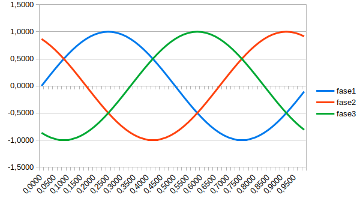

A equação de cada um dos sinais é dada por:

```
SinalFase0 = seno(2 * pi * (tempo + 0/3))
SinalFase1 = seno(2 * pi * (tempo + 1/3))
SinalFase2 = seno(2 * pi * (tempo + 2/3))
```

:warning: **Nota:** o valor do sinal também deve ser multiplicado pela tensão máxima do dispositivo gerador.

### Sinal: Prática

**Sem descarga parcial:** A seguir são ilustrados alguns exemplos de sinais de uma linha de tensão em operação normal.

| Instância | Com 800000 dados                                      | Com 800 dados (média móvel aplicada)            |
|-----------|-------------------------------------------------------|-------------------------------------------------|
| inst1.csv | 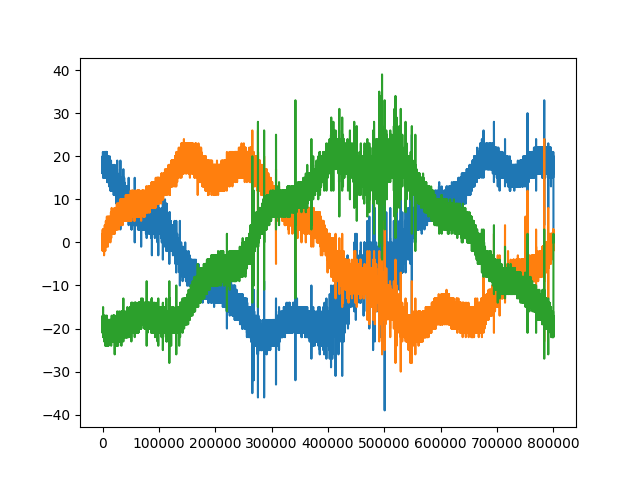  | 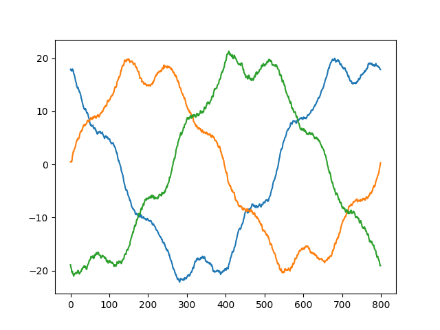  |
| inst3.csv | 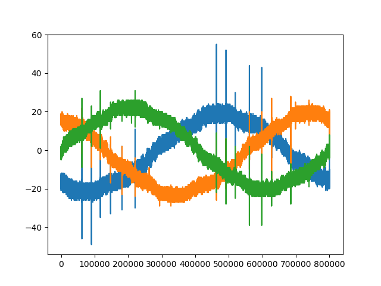  | 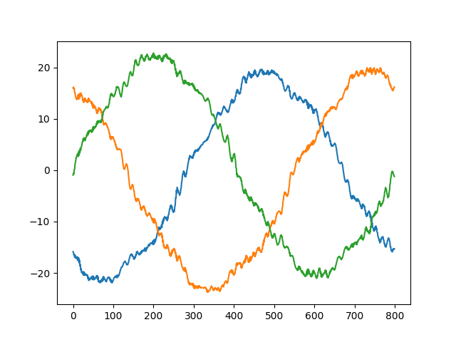  |
| inst4.csv | 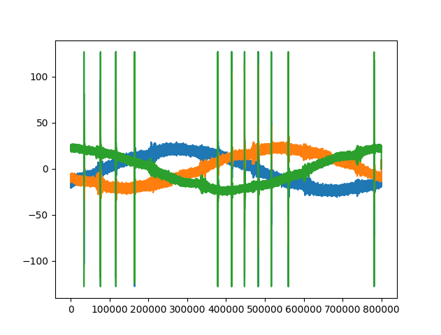  | 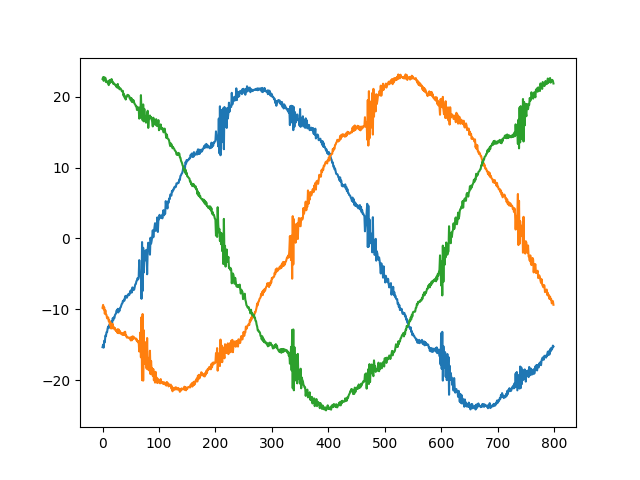  |
| inst5.csv | 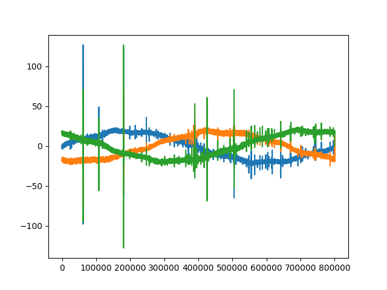  | 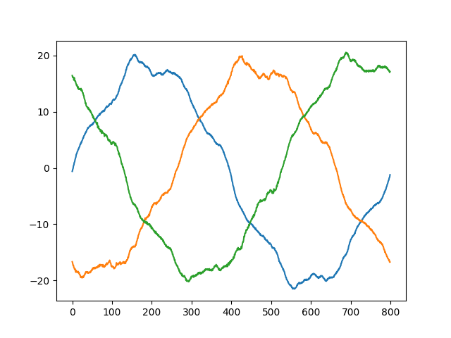  |
| inst6.csv | 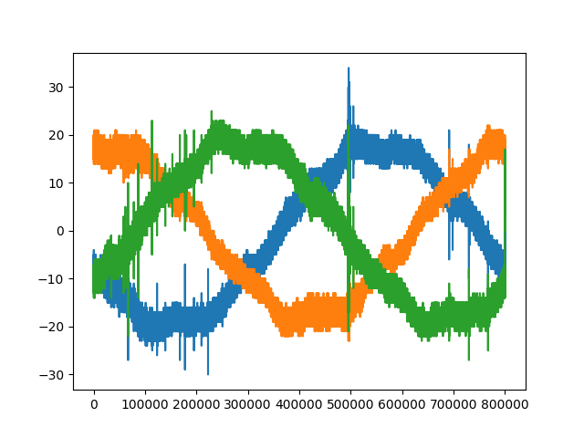  | 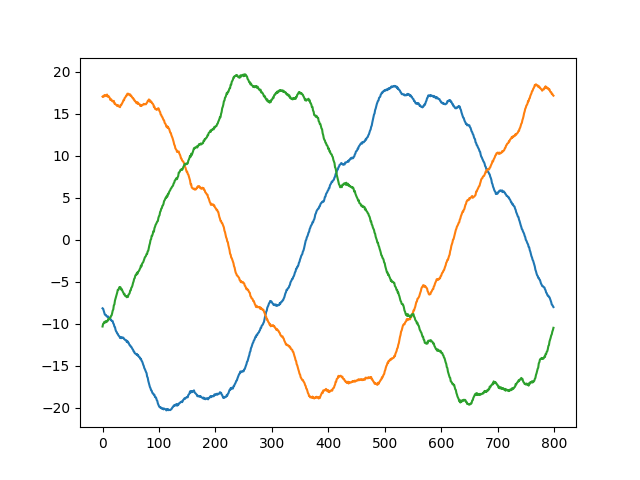  |

**Com descarga parcial:** A seguir são ilustrados alguns exemplos de sinais de uma linha de tensão em operação ruim.

| Instância  | Com 800000 dados                                      | Com 800 dados (média móvel aplicada)            |
|------------|-------------------------------------------------------|-------------------------------------------------|
| inst2.csv  | 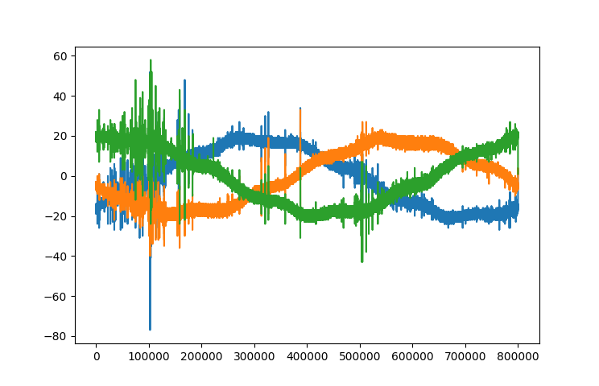  | 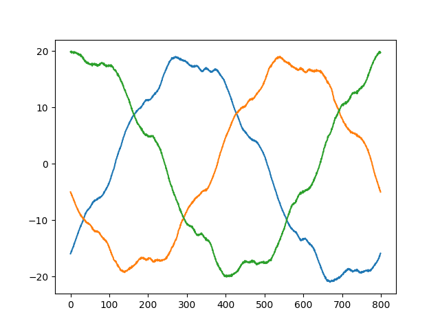  |
| inst68.csv | 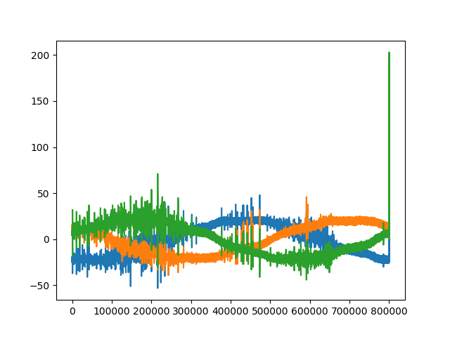 | 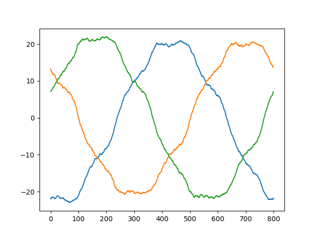 |
| inst77.csv | 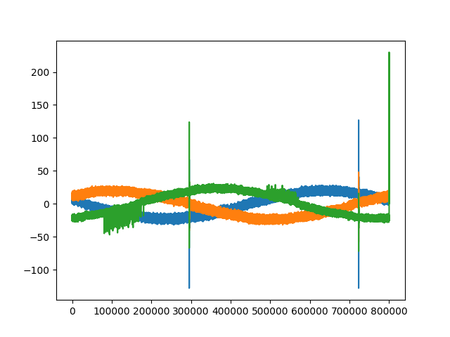 | 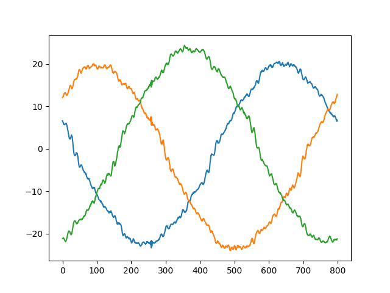 |
| inst91.csv | 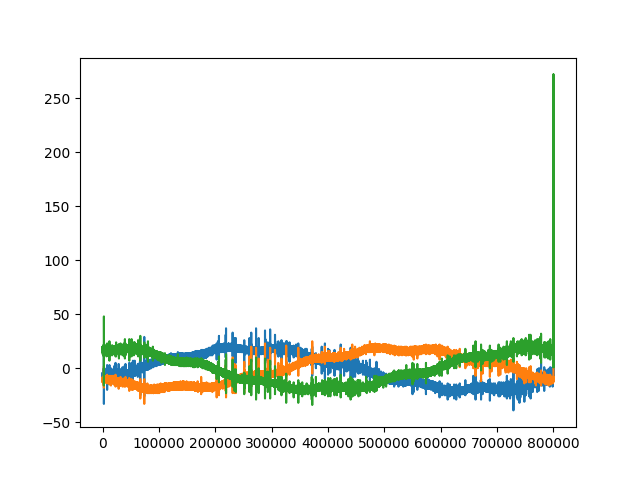 | 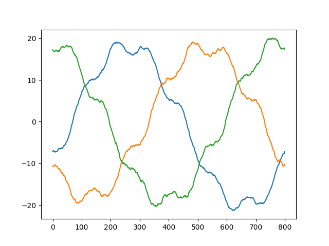 |
| inst94.csv | 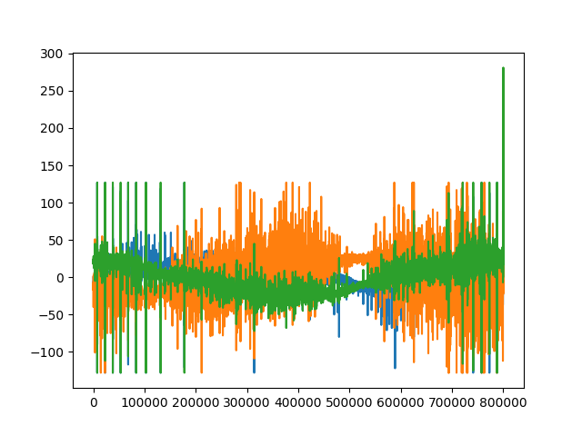 | 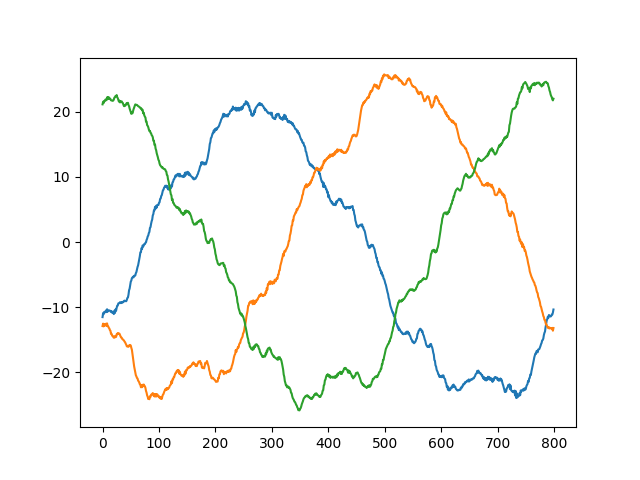 |

## Geração de Imagem a Partir do Sinal

Um experimento de geração de uma imagem em RGB a partir das três fases foi feito. Para isso um mapeamento das fases para o canal de cores foi criado.

```
RED = Phase0
GREEN = Phase1
BLUE = Phase2
```

Os valores das fases foram normalizados entre 0 a 255. Com limitações de máximo (40) e mínimo (-40). Os valores que ultrapassaram esse limiar foram definidos como sendo a cor branca. Veja o esquema sobre essa transformação de sinal em imagem a seguir.

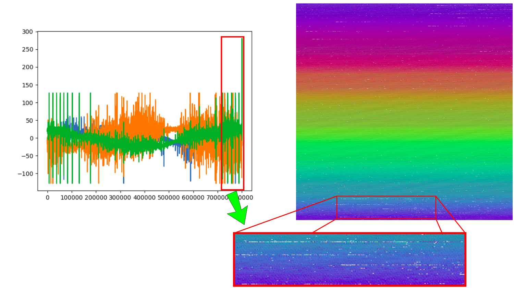

A seguir são encontradas um conjunto de imagens geradas a partir das fases. A coluna da esquerda representa uma imagem sem descarga parcial e a coluna da direita representa uma imagem com descarga parcial.

| Instância | Sem descarga parcial                                      | Com descarga parcial                                       |
|-----------|-----------------------------------------------------------|------------------------------------------------------------|
| [1 e 2]   |   |    |
| [3 e 68]  |   |   |
| [4 e 77]  |   |   |
| [5 e 91]  |   |   |
| [6 e 94]  |   |   |
| [7 e 96]  |   |   |
| [8 e 99]  |   |   |
| [9 e 137] |   |  |
| [10 e 145]|  |  |
| [11 e 146]|  |  |
| [12 e 153]|  |  |

## Testes de Correlação entre as Fases

Alguns experimentos foram conduzidos de foram a identificar a correlação entre as fases dos sinais.

Dois tipos de experimentos foram desenvolvidos: sem deslocamento das fases e com deslocamento das fases. Alguns dos resultados são mostrados a seguir.

### Experimentos Sem Deslocamento das Fases dos Sinais

Instância 1

```
Teste Correlação de Pearson R:
    coeficiente da correlação R: -0.4885
    p-value reference (alpha): 0.0500
    Interpretação: Baixa probabilidade da correlação ser ao acaso
    Interpretação: Correlação moderada
Teste Correlação de Pearson R:
    coeficiente da correlação R: -0.5137
    Interpretação: Baixa probabilidade da correlação ser ao acaso
    Interpretação: Correlação moderada
Teste Correlação de Pearson R:
    coeficiente da correlação R: -0.4767
    Interpretação: Baixa probabilidade da correlação ser ao acaso
    Interpretação: Correlação moderada

Teste Correlação de Spearman R:
    coeficiente da correlação R: -0.4756
    Interpretação: Baixa probabilidade da correlação ser ao acaso
    Interpretação: Correlação moderada
Teste Correlação de Spearman R:
    coeficiente da correlação R: -0.5000
    Interpretação: Baixa probabilidade da correlação ser ao acaso
    Interpretação: Correlação moderada
Teste Correlação de Spearman R:
    coeficiente da correlação R: -0.4635
    Interpretação: Baixa probabilidade da correlação ser ao acaso
    Interpretação: Correlação moderada
```

Instância 2

```
Teste Correlação de Pearson R:
    coeficiente da correlação R: -0.4911
    Interpretação: Baixa probabilidade da correlação ser ao acaso
    Interpretação: Correlação moderada
Teste Correlação de Pearson R:
    coeficiente da correlação R: -0.5143
    Interpretação: Baixa probabilidade da correlação ser ao acaso
    Interpretação: Correlação moderada
Teste Correlação de Pearson R:
    coeficiente da correlação R: -0.4785
    Interpretação: Baixa probabilidade da correlação ser ao acaso
    Interpretação: Correlação moderada

Teste Correlação de Spearman R:
    coeficiente da correlação R: -0.4724
    Interpretação: Baixa probabilidade da correlação ser ao acaso
    Interpretação: Correlação moderada
Teste Correlação de Spearman R:
    coeficiente da correlação R: -0.4961
    Interpretação: Baixa probabilidade da correlação ser ao acaso
    Interpretação: Correlação moderada
Teste Correlação de Spearman R:
    coeficiente da correlação R: -0.4649
    Interpretação: Baixa probabilidade da correlação ser ao acaso
    Interpretação: Correlação moderada
```

Instância 94

```
Teste Correlação de Pearson R:
    coeficiente da correlação R: -0.4305
    Interpretação: Baixa probabilidade da correlação ser ao acaso
    Interpretação: Correlação moderada
Teste Correlação de Pearson R:
    coeficiente da correlação R: -0.5830
    Interpretação: Baixa probabilidade da correlação ser ao acaso
    Interpretação: Correlação moderada
Teste Correlação de Pearson R:
    coeficiente da correlação R: -0.4159
    Interpretação: Baixa probabilidade da correlação ser ao acaso
    Interpretação: Correlação moderada
    
Teste Correlação de Spearman R:
    coeficiente da correlação R: -0.4273
    Interpretação: Baixa probabilidade da correlação ser ao acaso
    Interpretação: Correlação moderada
Teste Correlação de Spearman R:
    coeficiente da correlação R: -0.5621
    Interpretação: Baixa probabilidade da correlação ser ao acaso
    Interpretação: Correlação moderada
Teste Correlação de Spearman R:
    coeficiente da correlação R: -0.4135
    Interpretação: Baixa probabilidade da correlação ser ao acaso
    Interpretação: Correlação moderada
```

### Experimentos Com Deslocamento das Fases dos Sinais

Instância 2

```
Teste Correlação de Pearson R:
    coeficiente da correlação R: 0.9963
    Interpretação: Baixa probabilidade da correlação ser ao acaso
    Interpretação: Correlação muito forte
Teste Correlação de Pearson R:
    coeficiente da correlação R: 0.9960
    Interpretação: Baixa probabilidade da correlação ser ao acaso
    Interpretação: Correlação muito forte
Teste Correlação de Pearson R:
    coeficiente da correlação R: 0.9958
    Interpretação: Baixa probabilidade da correlação ser ao acaso
    Interpretação: Correlação muito forte
    
Teste Correlação de Spearman R:
    coeficiente da correlação R: 0.9921
    Interpretação: Baixa probabilidade da correlação ser ao acaso
    Interpretação: Correlação muito forte
Teste Correlação de Spearman R:
    coeficiente da correlação R: 0.9921
    Interpretação: Baixa probabilidade da correlação ser ao acaso
    Interpretação: Correlação muito forte
Teste Correlação de Spearman R:
    coeficiente da correlação R: 0.9923
    Interpretação: Baixa probabilidade da correlação ser ao acaso
    Interpretação: Correlação muito forte
```

Instância 94

```
Teste Correlação de Pearson R:
    coeficiente da correlação R: 0.9551
    Interpretação: Baixa probabilidade da correlação ser ao acaso
    Interpretação: Correlação muito forte
Teste Correlação de Pearson R:
    coeficiente da correlação R: 0.9612
    Interpretação: Baixa probabilidade da correlação ser ao acaso
    Interpretação: Correlação muito forte
Teste Correlação de Pearson R:
    coeficiente da correlação R: 0.9588
    Interpretação: Baixa probabilidade da correlação ser ao acaso
    Interpretação: Correlação muito forte
    
Teste Correlação de Spearman R:
    coeficiente da correlação R: 0.9610
    Interpretação: Baixa probabilidade da correlação ser ao acaso
    Interpretação: Correlação muito forte
Teste Correlação de Spearman R:
    coeficiente da correlação R: 0.9695
    Interpretação: Baixa probabilidade da correlação ser ao acaso
    Interpretação: Correlação muito forte
Teste Correlação de Spearman R:
    coeficiente da correlação R: 0.9645
    Interpretação: Baixa probabilidade da correlação ser ao acaso
    Interpretação: Correlação muito forte
```

Esses experimentos mostraram que ao realizar o deslocamento das fases uma alta correlação é encontrada entre as fases. O que era de fato esperado.

## Arquitetura da Solução

O algoritmo Multi-Layer Perceptron (MLP) foi utilizado para resolver esse problema de classificação.

Como o problema conta com uma grande quantidade de colunas (dados) e poucas instâncias, primeiramente foi feita a extração de features de forma a extrair informações dos sinais. Ao todo foram selecionadas 38 features para o problema. 

As 38 features são listadas a seguir: mean_sum, mean_sum_abs, mean_sum2, rms_sum, rms_sum_abs, rms_sum2, std_sum, std_sum_abs, std_sum2, kurtosis_sum, kurtosis_sum_abs, kurtosis_sum2, skew_sum, skew_sum_abs, skew_sum2, min_sum, min_sum2, max_sum2, intensidade, cont, intensidade_quad, cont_quad, rms_phase0, rms_phase1, rms_phase2, std_phase0, std_phase1, std_phase2, kurtosis_phase0, kurtosis_phase1, kurtosis_phase2, skew_phase0, skew_phase1, skew_phase2, corr_phase0_phase1, corr_phase1_phase2, corr_phase2_phase0.

A arquitetura geral da rede neural é mostrada na imagem a seguir: 

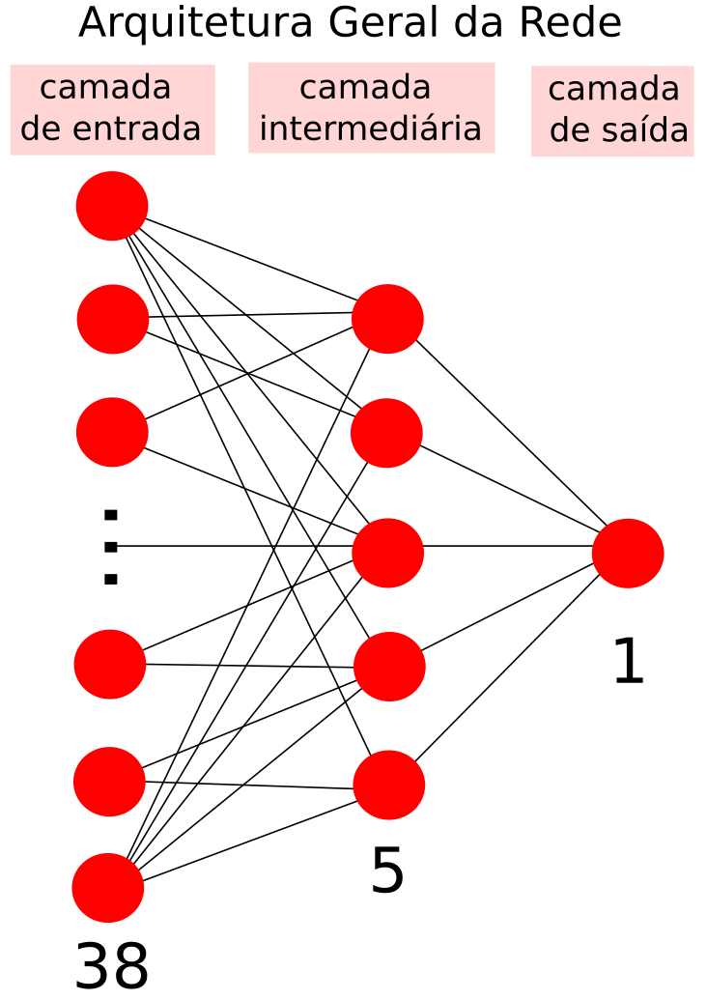

O conjunto de dados foram separados em duas partes: uma para treinamento e outra para validação. Das 167 instâncias as primeiras 100 foram separadas para o treinamento. As 67 instâncias restantes foram separadas para validação. 

Foram avaliados dois modelos um com 38 features e outro com 31 features. O modelo com mais features teve um resultado melhor.

mean_sum, mean_sum_abs, mean_sum2, rms_sum, rms_sum_abs, rms_sum2, std_sum, std_sum_abs, std_sum2, kurtosis_sum, kurtosis_sum_abs, kurtosis_sum2, skew_sum, skew_sum_abs, skew_sum2, min_sum, min_sum2, max_sum2, intensidade, cont, intensidade_quad, cont_quad, std_phase0, std_phase1, std_phase2, kurtosis_phase0, kurtosis_phase1, kurtosis_phase2, skew_phase0, skew_phase1, skew_phase2

Resultado do modelo 1: com 38 features

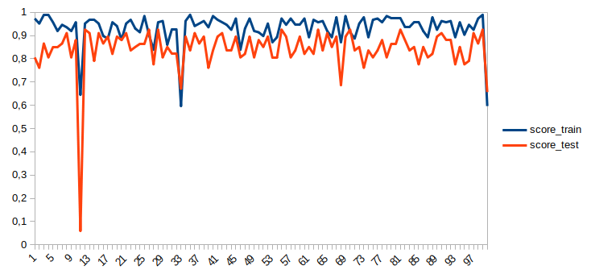

Resultado do modelo 2: com 31 features

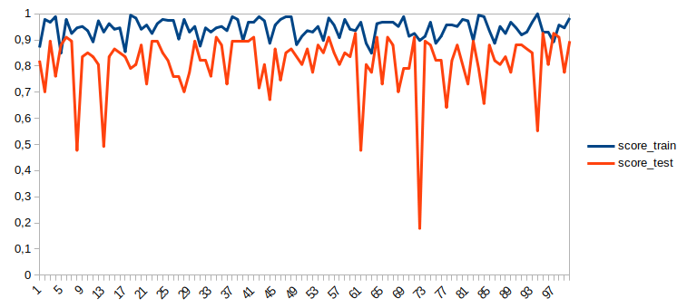

